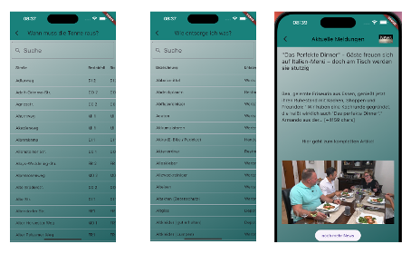

mamv2

Hier entsteht die Müll App Marl
Das ist die erste Version mit GUI. Zurzeit werden die Screens gecodet. Ihr werdet bald Screenshots bekommen.
## Implementierung einer kleinen Funktionalität
Die grundlegenden Screens sind hinzugefügt. Die Navigation zu den Hauptscreens ist implementiert.
Grundlegende Grafiken sind als Platzhalter eingefügt. 
Somit ist bis hierhin die Richtung dr App erkennbar.

### Vorschau auf die weiteren Änderungen
 Das Design wird einheitlich angepasst und durch zusammen passende hochwertige Grafiken ersetzt. Des Weiteren werden die Screens mir Eingabemöglichkeiten und einer Basislogik versehen. Die Entwicklung läuft

 #### 
 es hat sich einiges getan. in der Version 2 gibt es jetzt einen durchsuchbaren interaktiven Kalender, welcher die Termine zur Abfuhr zeigt. 
 Dies wurde alles über konvertierte CSV Dateien erreicht, da es kein API gibt.
 Des Weiteren gibt es im Abfall ABC auch eine Suchfunktion die das l#stige scrollen ersetzt. Die News wurden testweise mit einer APi implementiert.

 Es wurde im ganzen Projekt das Theme angepasst und unnötige Code Snippets entfernt. 
 Die Struktur wurde angepasst. 
 Die Repositorys wurden auf einzelne Repositorys verteilt und eingebunden.

 Es gibt neue Screenshots für Kalender / Abfall ABC und News Seite

 