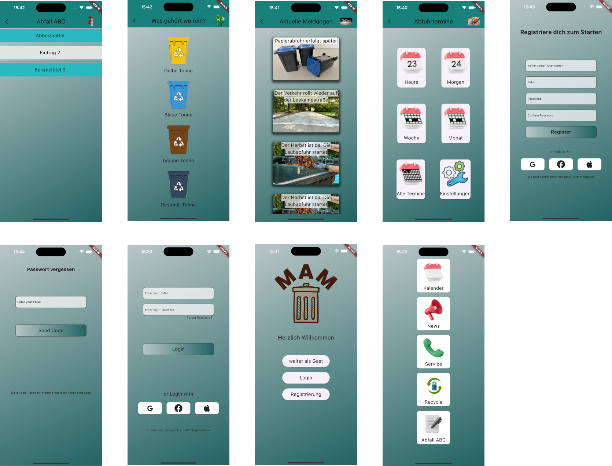

# mam_projekt_v1

Hier entsteht die Müll App Marl
Das ist die erste Version mit GUI. Zurzeit werden die Screens gecodet. Ihr werdet bald Screenshots bekommen.
## Implementierung einer kleinen Funktionalität
Die grundlegenden Screens sind hinzugefügt. Die Navigation zu den Hauptscreens ist implementiert.
Grundlegende Grafiken sind als Platzhalter eingefügt. 
Somit ist bis hierhin die Richtung dr App erkennbar.

### Vorschau auf die weiteren Änderungen
 Das Design wird einheitlich angepasst und durch zusammen passende hochwertige Grafiken ersetzt. Des Weiteren werden die Screens mir Eingabemöglichkeiten und einer Basislogik versehen. Die Entwicklung läuft